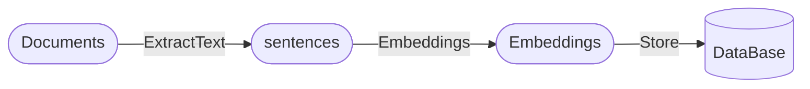
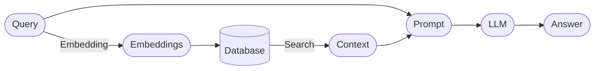

    
&nbsp;

    

        <b>🧐 Knowledge QA LLM</b>
    

    
&nbsp;

     <a href="">=3.8,<3.12-aff.svg"></a>
     
     
     
     
     
     

### 简介

基于本地知识库+LLM的问答系统。该项目的思路是由[langchain-ChatGLM](https://github.com/imClumsyPanda/langchain-ChatGLM)启发而来。

- 缘由：
    - 之前使用过这个项目，感觉不是太灵活，部署不太友好。
    - 借鉴[如何用大语言模型构建一个知识问答系统](https://mp.weixin.qq.com/s/movaNCWjJGBaes6KxhpYpg)中思路，尝试以此作为实践。
- 优势：
    - 整个项目为模块化配置，不依赖`lanchain`库，各部分可轻易替换，代码简单易懂。
    - 除需要单独部署大模型接口外，其他部分用CPU即可。
    - 支持常见格式文档，包括txt、md、pdf, docx, pptx, excel等等。当然，也可自定义支持其他类型文档。

### 整体流程

#### 解析文档并存储在数据库

#### 检索并回答问题

### 使用的工具

- 文档分析: [`extract_office_content`](https://github.com/SWHL/ExtractOfficeContent), [`rapidocr_pdf`](https://github.com/RapidAI/RapidOCRPDF), [`rapidocr_onnxruntime`](https://github.com/RapidAI/RapidOCR)
- 提取语义向量: [`moka-ai/m3e-small`](https://huggingface.co/moka-ai/m3e-base)
- 向量存储: `sqlite`
- 向量检索: [`faiss`](https://github.com/facebookresearch/faiss)
- UI搭建: [`streamlit>=1.25.0`](https://github.com/streamlit/streamlit)
